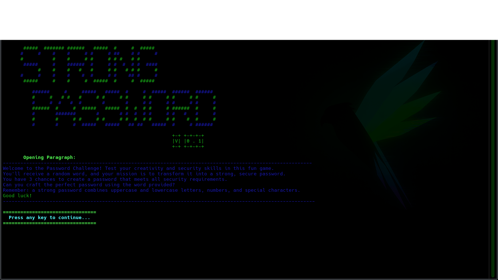

# 🔐 STRONG PASSWORD GAME

A fun and educational command-line game that challenges you to create strong passwords using randomly provided words. Test your creativity and learn about password security best practices while playing!



## 🎮 About

STRONG PASSWORD GAME is an interactive terminal-based game written in C that teaches password security through an engaging challenge. The game presents you with a random word from its dictionary, and your task is to incorporate that word into a strong password that meets specific security criteria.

**The Challenge:** Create a password that includes the given random word while satisfying all security requirements!

## ✨ Features

- 🎲 **Random Word Generation** - Each game presents a new random word from an extensive word list
- 🔍 **Real-time Password Validation** - Instant feedback on password strength
- 📚 **Educational Tool** - Learn password security best practices while playing
- 💻 **Command-line Interface** - Lightweight and fast terminal-based gameplay
- ✅ **Comprehensive Security Checks** - Validates multiple password criteria

## 🎯 Password Requirements

To win the game, your password must meet ALL of the following criteria:

- ✓ Contains **lowercase letters** (a-z)
- ✓ Contains **uppercase letters** (A-Z)
- ✓ Contains **numbers** (0-9)
- ✓ Contains **special characters** (!@#$%^&*, etc.)
- ✓ **Minimum length of 12 characters**
- ✓ **Must include the randomly provided word**

## 🚀 Quick Start

### Prerequisites

- GCC compiler (or any C compiler)
- Make utility (optional, for using Makefile)

### Installation

1. Clone the repository:
```bash
git clone https://github.com/Dostofine/STRONG_PASSWORD_GAME.git
cd STRONG_PASSWORD_GAME
```

2. Compile the game:
```bash
make
```

Or compile manually:
```bash
gcc -o password_game SRC/*.c -I include
```

3. Run the game:
```bash
./password_game
```

## 🎲 How to Play

1. Launch the game from your terminal
2. The game will present you with a **random word** from the word list
3. Create a password that:
   - Incorporates the given word
   - Meets all security requirements listed above
4. Enter your password and see if it passes all checks
5. Win by creating a strong password with the given word!

## 📁 Project Structure

```
STRONG_PASSWORD_GAME/
├── SRC/                    # Source code files
├── include/                # Header files
├── DATA/
│   └── word_listes/       # Word list database for random word selection
├── DOCS/                  # Documentation and screenshots
├── Makefile               # Build automation
├── LICENSE                # MIT License
└── README.md              # This file
```

## 🛠️ Built With

- **Language:** C
- **Compilation:** GCC/Make
- **Platform:** Cross-platform (Linux, macOS, Windows with proper compiler)

## 🎓 Learning Outcomes

By playing this game, you'll learn:

- What makes a password strong
- How to combine different character types effectively
- The importance of password length
- Creative ways to create memorable yet secure passwords
- Real-world password security best practices

## 📝 License

This project is licensed under the MIT License - see the [LICENSE](LICENSE) file for details.

## 👨‍💻 Author

**Dostofine**

- GitHub: [@Dostofine](https://github.com/Dostofine)

## 🌟 Acknowledgments

- Inspired by password security education initiatives
- Built as a learning project to demonstrate C programming skills
- Thanks to all contributors and players!

## 💡 Future Ideas

- [ ] Multiple difficulty levels
- [ ] Score system based on password complexity
- [ ] Hint system for beginners
- [ ] Time challenge mode
- [ ] Leaderboard functionality
- [ ] More extensive word lists
- [ ] Custom word list import

---

**Enjoy the game and stay secure! 🔒**

If you found this project helpful or fun, please consider giving it a ⭐!